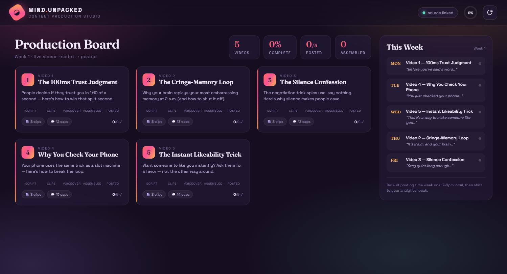
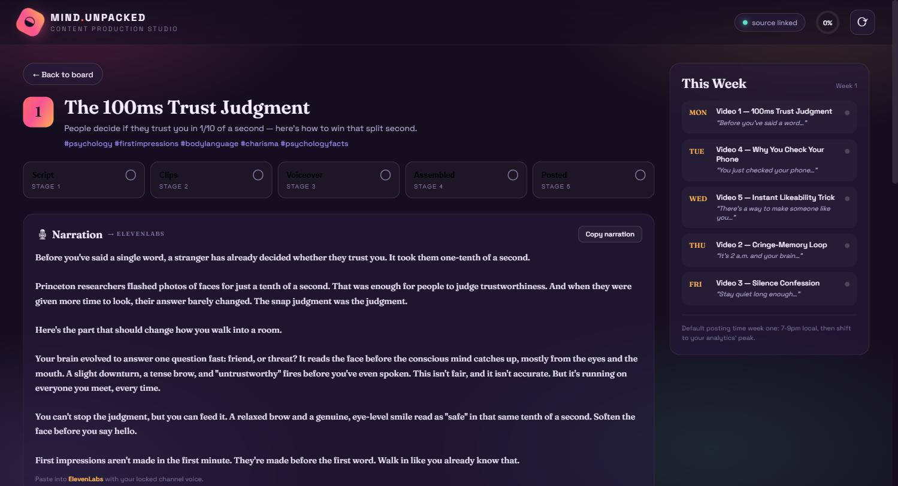

# 🧠 Content Dashboard

### A production board for faceless short-form video — track every clip from script to posted in one place.

### [▶️ Get it on Gumroad](#) &nbsp;`[Buy link — coming soon]`

  

---

## What it does

Content Dashboard turns a folder of plain-text scripts into a living production board for running a faceless short-form video channel (TikTok · YouTube Shorts · Instagram Reels). Every video moves through five stages — **Script → Clips → Voiceover → Assembled → Posted** — with one-click copy buttons that feed straight into ElevenLabs, Kling, and CapCut.

The dashboard **reads** from your content package and never modifies it. The only thing it writes is a small `status.json` of your stage toggles and checklist ticks, so your source scripts stay pristine and your progress survives restarts.

## Who it's for

Solo creators and small teams running a content channel who want a calm, single-screen view of what's done and what's next — without spreadsheets, sticky notes, or a heavyweight project tool. Drop in your scripts and the board builds itself.

## Features

- **Production board** — every video as a card with a five-stage tracker you can toggle inline, progress bars, and an overall completion ring.
- **Video detail view** — narration with a one-click *Copy* button for ElevenLabs, numbered visual prompts each with their own copy button for Kling, timed captions with *Copy all* for CapCut, A/B hooks, and collapsible assembly notes.
- **Per-video pre-post checklist** with persisted tickboxes.
- **This Week panel** — the posting schedule parsed from your content calendar, with a live "posted" dot per day.
- **Robust by design** — missing files degrade gracefully (banners, not crashes), with manual and soft auto-refresh.

## Screenshots

| Production board | Video detail |
|---|---|
|  |  |

*Left: the production board — five videos, a five-stage tracker per card, completion ring, and the week's posting schedule. Right: the video detail view — narration with a one-click copy for ElevenLabs, plus visual prompts, captions, and a pre-post checklist.*

## How it works

A thin Flask backend parses your content folder — one `video-N-...` subfolder per video containing `narration.txt`, `visual-prompts.txt`, `captions.txt`, `assembly.md`, and `post.md` — and serves it to a single-page vanilla-JS frontend. Stage toggles and checklist ticks post back to a file-locked, atomically-written `status.json`. No database, no build step, no secrets: one `pip install flask` and you're running.

## Tech stack

`Python 3` · `Flask` (read-only content parser) · vanilla JS + CSS single-page app (no framework, no build) · local `status.json` state · Fraunces + Space Grotesk type

---

## ▶️ Get Content Dashboard

`[Buy link — coming soon]` — a Gumroad listing for this tool isn't live yet.

*This is a showcase repository — it contains the product overview and screenshots only. The full source is available with your purchase.*

 

**Built by Hugo Kuznicki**

[🌐 Website](https://kuznickicapital-ship-it.github.io/personal-site/) · [📰 Newsletter](https://hugos-newsletter-e0c067.beehiiv.com/) · [𝕏 @Kuznickihugo](https://x.com/Kuznickihugo)

If my tools save you time, you can [💜 sponsor my work on GitHub](https://github.com/sponsors/kuznickicapital-ship-it).

